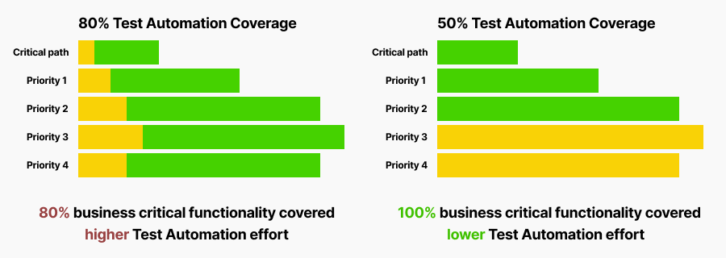
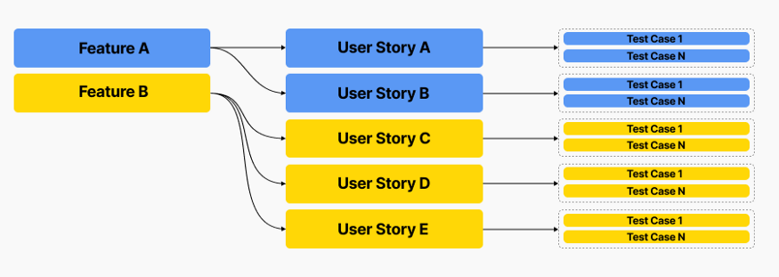

Do you have Test Automation Coverage as a key measurement of testing effectiveness? Not yet? Then, you are in a better position to avoid stepping on a rake. If yes, it is a good point to reconsider your delivery and quality goals and reinvest in something more beneficial. I have dealt with dozens of projects and many of them are captive to metrics somebody told them to track. Some of them are also under the influence of outdated trends.

I’ll tell below why coverage metrics may be misleading and how to stick to meaningful measurements. Let’s figure it out.

Sometimes project teams misinterpret Test Automation coverage and use it as a measurement of manual effort vs. automated execution. There is a huge difference between coverage and automation maturity. If you had tons of manual test cases and your team automated 80% of them, does it mean you have 80% of you testing effort automated? Nope. It likely means you spent thousands of man-hours to automate irrelevant, outdated, not repetitive, low priority and meaningless test scenarios.

## Risk Coverage vs. Test Coverage

Risk-based Test Automation coverage is the answer.

If you have centralized dashboard for your entire team with Test Automaton Coverage metric — that’s great! Now you can go there and remove Test Coverage chart whatever number it shows. Instead, calculate how much of your business critical and repeatable testing is covered by automated tests. As we figured out, it doesn’t matter what part of your test cases is covered by automation. What matters most — is ability to validate your critical and high priority business functionality and receive feedback as quick as possible by running automated test suite.

> Risk-based testing is a type of software testing that functions as an organizational principle used to prioritize the tests of features and functions in software, based on the risk of failure, the function of their importance and likelihood or impact of failure.
> Same principle can be applied to automated testing as well.

As a next step, analyze your test execution and answer these questions: “How often do you run your tests?”, “Which tests are most repetitive and give you most meaningful feedback?”, “Which types of failures might impact your business most?”, “What you need to validate to minimize the risk?”. Once you have answers to these questions, go ahead and (re)prioritize test scenarios. It may happen that most meaningful test automation coverage already exist, or you need to focus more on automation of critical user journeys.

## Enable traceability and test to feature mapping

As soon as you have relevant prioritization, it is a good point to link automated tests to business risk. Follow this step-by-step guide to achieve smart prioritization and full traceability:
- prioritize your features and test cases if you didn’t do this yet;
- assign priorities to all your automated tests (luckily most automation tools allow to do this out of the box with the help of categorization);
- create custom attributes in the code to implement specific mechanism to reference functional areas;
- enable traceability from features to automated tests by referencing related functionality in test case metadata;
- build dynamic test suites based on referenced functionality and priorities assigned;
- track coverage for critical functional areas and high priority scenarios.

Now you have fully traceable and prioritized dynamic test suites which you can trigger automatically after some additional manipulations within you CICD pipeline. The more often you run them, the more value you get from initial investments in automation.

And finally, establish clear KPIs for test automation team and track progress on dashboards. This is reliable way to keep automation effort under control and still get more value from it.

...

Thanks for reading and stay tuned for further stories! I will tell how to enable smart test coverage from business features to automation code and trigger dynamically created test suites from your CICD tool.
